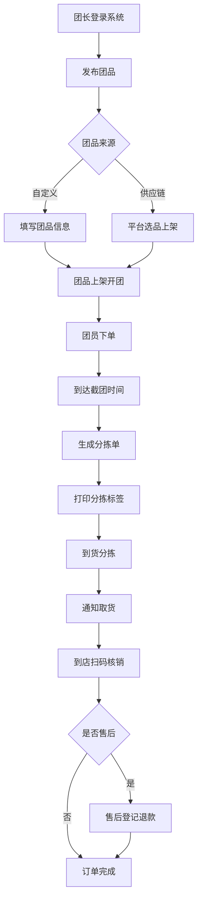

## 1. 产品概述

社区团购团长端管理系统，服务于社区团购团长的日常运营管理。团长可通过本系统发布团品、统计团员下单、到货分拣打印标签、扫码核销取货，以及处理售后退款。支持团长自定义上架团品和对接平台供应链选品两种模式。

## 2. 核心功能

### 2.1 用户角色

| 角色 | 登录方式 | 核心权限 |
|------|---------|---------|
| 团长 | 账号登录/模拟登录 | 商品发布、订单管理、分拣打印、取货核销、售后登记、数据统计 |

### 2.2 功能模块

1. **仪表盘首页**：今日数据概览、待办提醒、近期订单趋势
2. **团品管理**：团品列表、发布自定义团品、对接平台供应链选品
3. **下单统计**：按团品/按团员维度统计、订单明细、导出报表
4. **到货分拣**：分拣单生成、按团员打印分拣标签、分拣进度
5. **取货核销**：扫码/手动核销、核销记录查询
6. **售后登记**：缺货退款、破损退款、质量问题退款、售后进度跟踪

### 2.3 页面详情

| 页面名称 | 模块名称 | 功能描述 |
|---------|---------|---------|
| 仪表盘 | 数据概览卡片 | 今日开团数、待取货数、待分拣数、售后待处理数 |
| 仪表盘 | 待办提醒 | 截团提醒、到货提醒、核销提醒、售后提醒 |
| 仪表盘 | 近期趋势 | 近7天订单量与销售额折线图 |
| 团品管理 | 团品列表 | 搜索筛选、状态切换、编辑、下架 |
| 团品管理 | 发布自定义团品 | 填写名称/规格/团购价/截团时间/预计到货日、上传图片 |
| 团品管理 | 供应链选品 | 平台商品库浏览、一键选品上架 |
| 下单统计 | 按团品统计 | 每个团品的下单人数、件数、金额 |
| 下单统计 | 按团员统计 | 每个团员的下单明细、总金额 |
| 下单统计 | 订单列表 | 全部订单、筛选、搜索、导出 |
| 到货分拣 | 分拣单 | 按团生成分拣单、显示各团员分拣汇总 |
| 到货分拣 | 分拣标签打印 | 按团员打印标签（姓名、电话、商品明细、取货码） |
| 取货核销 | 核销台 | 输入取货码/扫码核销、一键标记已取 |
| 取货核销 | 核销记录 | 历史核销记录、按日期筛选 |
| 售后登记 | 售后列表 | 全部售后单、按状态/类型筛选 |
| 售后登记 | 新建售后 | 选择订单、选择售后类型（缺货/破损/质量问题）、填写金额和备注、提交退款 |

## 3. 核心流程

### 3.1 团品发布流程
团长登录 → 进入团品管理 → 选择"自定义团品"或"供应链选品" → 填写团品信息（名称、规格、团购价、截团时间、预计到货日）→ 发布上架 → 团员可下单

### 3.2 订单分拣与取货流程
团员下单（模拟数据）→ 截团时间到达 → 生成分拣单 → 按团员打印分拣标签 → 到货后按标签分拣 → 团员到店 → 扫码/输入取货码 → 核销完成

### 3.3 售后处理流程
团员提出售后需求 → 团长进入售后登记 → 关联对应订单 → 选择售后类型（缺货/破损/质量问题）→ 填写退款金额与问题描述 → 提交退款 → 售后完成

## 4. 用户界面设计

### 4.1 设计风格

- **主色调**：暖橙色 #FF6B35（团购活力感）搭配深绿 #1B5E20（新鲜、品质）
- **辅助色**：琥珀色 #FFB74D、薄荷绿 #81C784、浅灰 #F5F5F5
- **按钮风格**：圆角 8px，主按钮实心橙，次按钮描边，悬停微微上浮阴影
- **字体**：展示字体 Noto Sans SC，正文系统默认无衬线
- **布局风格**：左侧导航 + 顶部面包屑 + 卡片式内容区
- **图标风格**：Lucide 线性图标，配色与主色一致

### 4.2 页面设计概览

| 页面名称 | 模块名称 | UI元素 |
|---------|---------|--------|
| 仪表盘 | 数据卡片 | 渐变色卡片 + 大号数字 + 图标 + 同比变化箭头 |
| 仪表盘 | 趋势图 | 双折线图（订单量/销售额）+ 区域渐变填充 |
| 团品管理 | 列表 | 表格 + 商品图缩略 + 状态标签（进行中/已截团/已完成） |
| 团品管理 | 发布表单 | 分组表单 + 日期时间选择器 + 图片上传预览 |
| 下单统计 | 统计面板 | Tab切换（按团品/按团员）+ 汇总数字卡 + 明细表格 |
| 到货分拣 | 分拣单 | 团员卡片列表 + 商品明细折叠 + 打印按钮 |
| 取货核销 | 核销台 | 大号输入框 + 扫码框视觉 + 核销结果动效 |
| 售后登记 | 新建表单 | 售后类型标签选择（3种颜色区分）+ 金额计算 + 提交确认 |

### 4.3 响应式

- 桌面端优先设计（1440px 基准）
- 平板端（768-1024px）：左侧导航折叠为图标，内容区自适应
- 移动端（<768px）：底部Tab导航，内容单列排布
- 打印场景：A4纸一页多标签专用打印样式，@media print 适配
