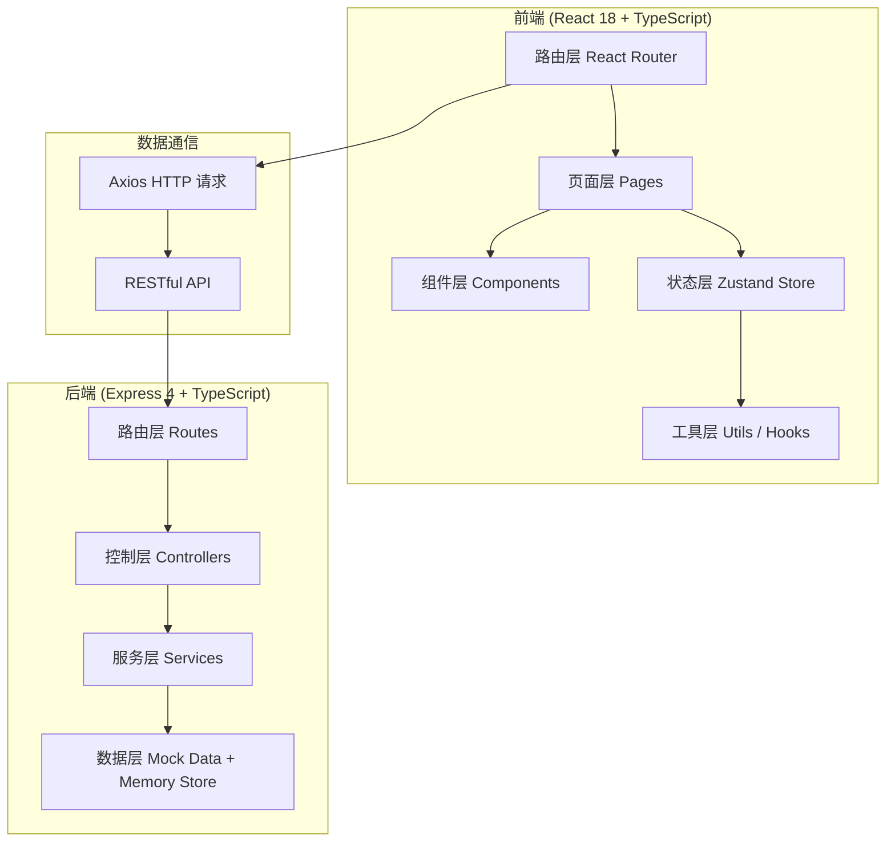
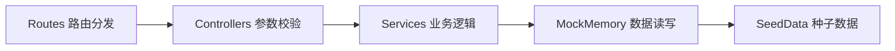
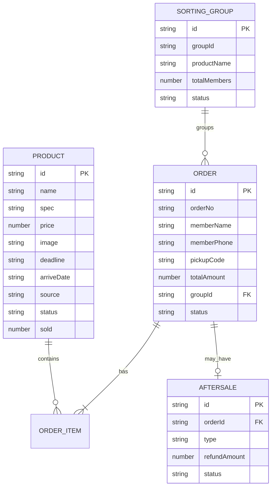

## 1. 架构设计



## 2. 技术描述

- **前端**：React@18 + TypeScript + tailwindcss@3 + Vite + React Router v6 + Zustand + Lucide React + Recharts
- **初始化工具**：vite-init（react-express-ts 模板）
- **后端**：Express@4 + TypeScript（ESM 模块）
- **数据存储**：内存级 Mock 数据（项目演示用），启动时注入种子数据
- **打印方案**：原生 window.print() + @media print 专用样式

## 3. 路由定义

| 路由 | 页面 | 用途 |
|------|------|------|
| / | Dashboard | 仪表盘首页，数据概览与待办 |
| /products | ProductList | 团品列表 |
| /products/new | ProductNew | 发布自定义团品 |
| /products/supply | ProductSupply | 供应链选品 |
| /orders | OrderStats | 团员下单统计 |
| /sorting | SortingList | 到货分拣单列表 |
| /sorting/:id | SortingDetail | 分拣单详情与打印 |
| /verification | Verification | 取货核销台 |
| /aftersale | AftersaleList | 售后登记列表 |
| /aftersale/new | AftersaleNew | 新建售后单 |

## 4. API 定义

### 4.1 团品 Products

```typescript
interface Product {
  id: string;
  name: string;
  spec: string;
  price: number;
  originPrice?: number;
  image: string;
  deadline: string;      // 截团时间 ISO
  arriveDate: string;    // 预计到货日 ISO
  source: 'custom' | 'supply';  // 自定义 / 供应链
  status: 'ongoing' | 'closed' | 'finished';
  stock: number;
  sold: number;
  createdAt: string;
}
```

| Method | Path | 描述 |
|--------|------|------|
| GET | /api/products | 获取团品列表（支持 source/status 查询） |
| GET | /api/products/:id | 获取单个团品详情 |
| POST | /api/products | 发布自定义团品 |
| PUT | /api/products/:id | 编辑团品信息 |
| PATCH | /api/products/:id/status | 切换团品状态 |
| GET | /api/supply/products | 获取平台供应链商品库 |

### 4.2 订单 Orders

```typescript
interface Order {
  id: string;
  orderNo: string;
  memberName: string;
  memberPhone: string;
  pickupCode: string;    // 取货码 6位
  items: OrderItem[];
  totalAmount: number;
  totalQuantity: number;
  productId?: string;    // 所属团品（如单团单团品）
  groupId: string;       // 所属团期
  status: 'pending' | 'sorted' | 'picked' | 'refunded';
  createdAt: string;
  pickedAt?: string;
}
interface OrderItem {
  productId: string;
  productName: string;
  spec: string;
  price: number;
  quantity: number;
  subtotal: number;
}
```

| Method | Path | 描述 |
|--------|------|------|
| GET | /api/orders | 订单列表（支持 productId/member/status 筛选） |
| GET | /api/orders/stats | 按团品/按团员统计数据 |
| GET | /api/orders/:id | 订单详情 |

### 4.3 分拣 Sorting

```typescript
interface SortingGroup {
  id: string;
  groupId: string;
  productName: string;
  deadline: string;
  arriveDate: string;
  totalMembers: number;
  totalQuantity: number;
  status: 'pending' | 'sorting' | 'done';
  orderIds: string[];
}
interface MemberSorting {
  orderId: string;
  memberName: string;
  memberPhone: string;
  pickupCode: string;
  items: OrderItem[];
  totalAmount: number;
  isSorted: boolean;
}
```

| Method | Path | 描述 |
|--------|------|------|
| GET | /api/sorting | 分拣单列表 |
| GET | /api/sorting/:id | 分拣单详情（含各团员分拣信息） |
| PATCH | /api/sorting/:id/mark | 标记分拣完成 |

### 4.4 核销 Verification

| Method | Path | 描述 |
|--------|------|------|
| POST | /api/verification/verify | 凭取货码/订单号核销 { code: string } |
| GET | /api/verification/records | 核销记录列表 |

### 4.5 售后 Aftersale

```typescript
interface Aftersale {
  id: string;
  orderId: string;
  orderNo: string;
  memberName: string;
  type: 'out_of_stock' | 'damaged' | 'quality';
  refundAmount: number;
  remark: string;
  productName?: string;
  status: 'pending' | 'approved' | 'completed';
  createdAt: string;
}
```

| Method | Path | 描述 |
|--------|------|------|
| GET | /api/aftersale | 售后单列表（支持 type/status 筛选） |
| POST | /api/aftersale | 新建售后单 |
| GET | /api/aftersale/:id | 售后详情 |
| PATCH | /api/aftersale/:id/status | 更新售后状态 |

## 5. 服务端架构



- **/api/routes**：按模块拆分路由（products/orders/sorting/verification/aftersale）
- **/api/controllers**：解析请求、返回标准 JSON { code, data, message }
- **/api/services**：核心业务逻辑（生成取货码、统计聚合、分拣汇总）
- **/api/data**：内存数据库 + 初始化种子数据（10+ 团品、30+ 订单、5+ 售后）

## 6. 数据模型

### 6.1 ER 图



### 6.2 种子数据设计

- 团品：6个自定义团品 + 4个供应链团品，覆盖进行中/已截团/已完成状态
- 团员：8个模拟团员（姓名+手机号）
- 订单：35条订单，分布在不同团期，含待分拣/已分拣/已取货状态
- 分拣单：3个团期分拣单，1个待分拣、1个分拣中、1个已完成
- 售后单：6条，覆盖3种售后类型，含处理中/已退款状态
